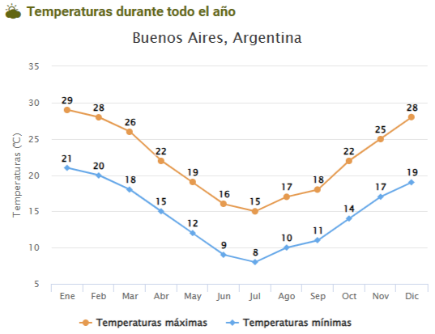

## 📋 Documentación de la parte práctica del segundo parcial para la materia Sistemas de procesamiento de datos - UTN Tecnicatura Superior en Programación.  

Desafio donde se busca simular un sistema que mida la temperatura ambiente y en caso de superar un umbral de temperatura determinado, poder accionar un sistema de protección contra incendios (en este caso se simula con el accionar de un motor servo). Dicho sistema se configuró para poder ser activado o desactivado mediante control remoto.

 
## Proyecto: Sistema protección contra incendios.

## Documentación 🚀
***

Este proyecto tiene como objetivo diseñar un sistema que involucre la conexión de un Display LCD, un sensor de temperatura, un sensor infrarrojo, un control remoto y un servo motor. Estos componentes en conjunto, simulan el armado y desarmado de un sistema de medición de temperatura ambiente. 

Cuando la temperatura se encuentre dentro de ciertos rangos específicos, se mostrarán los cambios de temperatura en el Display y se activará o desactivará el sistema de protección contra incendios, según sea necesario.

- Al presionar el botón "1" en el control remoto, se activa el sistema de protección contra incendios.
- Al presionar el botón "0" en el control remoto, se desactiva el sistema de protección contra incendios.
- Por defecto el sistema queda activo y en caso de sobrepasar los 45° dará aviso, y al llegar a los 60° se activará automáticamente.  

Los rangos de temperatura fueron determinados acorde a las temperaturas según la fecha del año en la ciudad de Buenos Aires. 

[Link del proyecto en Tinkercad ](https://www.tinkercad.com/things/8GWDxIeaJW2?sharecode=i-sa3b0VmvMuYl93LeVbV0PcAkHp6EFGsrdCXIxf44I "Enlace del proyecto en Tinkercad")

## Componentes 🔩

Componentes mínimos necesarios:  
1 Arduino Uno.  
1 Sensor de temperatura.  
1 Control remoto.
1 Sensor IR (infrarrojo).    
1 Servomotor
1 Potenciómetro (para regular el contraste del LCD)
RESISTENCIAS NECESARIAS PARA CADA COMPONENTE.

## Esquema 🔩
***

## Código del programa: 🔩

* * *

 ~~~ C (Lenguaje del código)
//INICIO Constantes
#define LED_NARANJA 9
#define LED_AZUL 12
#define SENSOR_TEMP A0
#define servo_pin 10
#define RECEIVER_PIN 11
#define controlTecla_cero 0xF30CBF00
#define controlTecla_uno 0xEF10BF00
#define controlTecla_dos 0xEE11BF00
#define controlTecla_tres 0xED12BF00
#define controlTecla_cuatro 0xEB14BF00
#define controlTecla_cinco 0xEA15BF00
#define controlTecla_seis 0xE916BF00
#define controlTecla_siete 0xE718BF00
#define controlTecla_ocho 0xE619BF00
#define controlTecla_nueve 0xE51ABF00
//FIN Constantes

//INICIO Librerias importadas
#include <Servo.h>
#include <LiquidCrystal.h>
#include <IRremote.h>
//FIN Librerias importadas

//INICIO Instancias 
Servo servo_alarma; //Instancio objeto
LiquidCrystal lcd(7,6,5,4,3,2);
//FIN Instancias

//INICIO Variables
int angulo_servo = 0;
int numero_presionado;
bool flag_incendio = false;
//FIN Variables

//INICIO Configuraciones principales
void setup()
{
  Serial.begin(9600);
  pinMode(LED_NARANJA, OUTPUT);
  pinMode(LED_AZUL, OUTPUT);
  servo_alarma.attach(servo_pin); //Al objeto servo que cree, le indico que pin debe usar
  lcd.begin(16,2); //Defino dimensiones del LCD conectado
  IrReceiver.begin(RECEIVER_PIN); //Inicializo al sensor infrarrojo
}
//FIN Configuraciones principales

//INICIO Funciones
int recibirNumero()
{
	int digito = 0;
  	
  	switch (IrReceiver.decodedIRData.decodedRawData)//La señal que recibo cuando un botón es presionado en el control es esta variable. Según el código que me envia ESTE particular control remoto que conecté lo convirto (en el loop principal) a Hexadecimal y a su vez, cada código le correspondera a una número en particular, dónde por el momento sólo configure los botones del 0 al 9. 
    {
      	case controlTecla_cero: //Si el botón 0 en el control remoto es apretado, entonces guardo en una variable de tipo entero el número que coincide con su valor.
      		digito = 0;
            break;
        case controlTecla_uno:
      		digito = 1;
            break;
        case controlTecla_dos:
      		digito = 2;
            break;
        case controlTecla_tres:
      		digito = 3;
            break;
        case controlTecla_cuatro:
            digito = 4;
      		break;
        case controlTecla_cinco:
            digito = 5;
      		break;
        case controlTecla_seis:
      		digito = 6;      
      		break;
        case controlTecla_siete:
      		digito = 7;
            break;
        case controlTecla_ocho:
            digito = 8;
      		break;
        case controlTecla_nueve:
            digito = 9;
      		break;
  		}
	return digito; // Guardo el resultado
} 
//FIN Funciones

//INICIO LOOP PRINCIPAL
void loop()
{
  
  //Las mediciones del sensor de temperatura se realizan de manera continua, por ende las variables deben ir en el loop principal para poder proporcionar un valor lo más acertado posible.
  int lectura_sens_temp = analogRead(SENSOR_TEMP); //Capto la lectura del sensor
  float voltaje = lectura_sens_temp * (5000 / 1024.0); // Convierto la lectura a voltaje
  float temp_celcius = (voltaje - 500) / 10; // Convierto el voltaje a grado celcius
  //Fin sensor de temperatura
 

 
  //Configuración sensor IR y control
  if(IrReceiver.decode())// Su valor constante es 0, pero si algún botón es presionado se convierte en 1 y pasa a ser "true". Cuando es "true" pasa el valor hexadecimal que le corresponde al botón según el control remoto
  {          
    numero_presionado = recibirNumero(); // Ese valor hexa se lo paso a la función que de acuerdo a las constantes definidas al principio del programa, me indicaran que valor númerico equivale a tal botón.
    IrReceiver.resume(); // Esto le permite "reiniciar" su estado al sensor infrarrojo y dejarlo listo para "escuchar" otra señal.
    

    //Desactivo el sistema anti incendios (simulado con el servo motor) a pedido del usuario
    if (numero_presionado == 0 && flag_incendio == true) //Si se presionó el botón 0 en el control y se detectó previamente una temperatura por encima de los 45°C
    {
    	servo_alarma.write(180); //Activo el motor y gira a 180°
      	lcd.clear(); // Limpio la pantalla del led
      	lcd.setCursor(0,0); //Preparo al LCD para poder imprimir texto en la posición x=0 e y=0
      	lcd.print("Sistema"); //Este texto va a la posición previamente definida
      	lcd.setCursor(0,1); //Ahora le paso para que imprima en la siguiente linea del LCD
    	lcd.print("desactivado");
      	digitalWrite(LED_NARANJA, 0); //Apago el LED indicador que se encendió previamente al detectarse una temperatura superior a los 45° C
    }
   
    

    if (numero_presionado == 1) //Si se presionó el botón 1 en el control remoto, el usuario activa nuevamente el sistema.
    {	
    	lcd.clear(); //Limpio pantalla
      	lcd.setCursor(0,0);
      	lcd.print("Sistema");
      	lcd.setCursor(0,1);
    	lcd.print("activado");
      	delay(1000);
    	flag_incendio = false; //Bajo la bandera de incendio, pero la temperatura seguirá siendo la misma.
    }
  }

  
  
  lcd.setCursor(0,0); //Limpio pantalla del LCD
  
  while (flag_incendio == false) //Mientras no haya incendio
  {
    if (temp_celcius < 45)
    {
    lcd.print("Temperatura");
    digitalWrite(LED_AZUL, 1);
  	digitalWrite(LED_NARANJA, 0);
    }

    if(temp_celcius <= 9)//Invierno (Se simulan de esta manera las estaciones, ya que no hay un reloj de sistema en Arduino, por lo cual no hay manera simple de determinar la fecha y hora)
    {
      Serial.println("Temperatura invernal");
      lcd.setCursor(0,1);
      lcd.print("invernal ");

    } 
    else if (temp_celcius > 9 && temp_celcius < 17)//Otoño (Se simulan de esta manera las estaciones, ya que no hay un reloj de sistema en Arduino, por lo cual no hay manera simple de determinar la fecha y hora)
    {
      Serial.println("Temperatura otoñal");
      lcd.setCursor(0,1);
      lcd.print("otonal ");

    } 
    else if (temp_celcius >= 17 && temp_celcius <= 24)//Primavera (Se simulan de esta manera las estaciones, ya que no hay un reloj de sistema en Arduino, por lo cual no hay manera simple de determinar la fecha y hora)
    { 
      Serial.println("Temperatura primaveral");
      lcd.setCursor(0,1);
      lcd.print("primaveral ");

    } 
    else if (temp_celcius > 24 && temp_celcius < 45)//Verano (Se simulan de esta manera las estaciones, ya que no hay un reloj de sistema en Arduino, por lo cual no hay manera simple de determinar la fecha y hora)
    {
      Serial.println("Temperatura veraniega");
      servo_alarma.write(180);
      Serial.println("Servo en 180");
      lcd.setCursor(0,1);
      lcd.print("veraniega ");

    } 
    else if (temp_celcius >= 45 && temp_celcius < 60)// En este rango de temperatura, se advierte al usuario.
    {
      Serial.println("Posible incendio");
      digitalWrite(LED_NARANJA, 1);
      digitalWrite(LED_AZUL, 0);
      lcd.setCursor(0,0);
      lcd.print("POSIBLE");
      lcd.setCursor(0,1);
      lcd.print("INCENDIO ");
    }
    else if (temp_celcius >= 60) //Se activa el sistema de protección contra incendios.
    {

      if (flag_incendio == false) //Si no hubo incendio previo
      {
          servo_alarma.write(90); //Simulación sistema de respuesta anti incendios.
          Serial.println("Servo en 90°");
          flag_incendio = true; 
      }

      digitalWrite(LED_NARANJA, 1);
      digitalWrite(LED_AZUL, 0);
      lcd.setCursor(0,0);
      lcd.print("SISTEMA ANTI");
      lcd.setCursor(0,1);
      lcd.print("INCENDIO ");
    }
    lcd.print(temp_celcius);
  }

}
//FIN LOOP PRINCIPAL

~~~

## 🤖 Link al proyecto 
---

 Proyecto [Sistema de protección contra incendios ](https://www.tinkercad.com/things/8GWDxIeaJW2?sharecode=i-sa3b0VmvMuYl93LeVbV0PcAkHp6EFGsrdCXIxf44I "Enlace del proyecto en Tinkercad") TinkerCad.
 - - - 

##  📘 Fuentes
---
- [Tecnicatura Universitaria en Programación - UTN](http://www.sistemas-utnfra.com.ar/#/pages/carrera/tecnico-programacion/resumen)
-  [Fuente configuración sensor IR](https://programarfacil.com/blog/arduino-blog/mando-a-distancia-arduino/)

Made with ❤️ by Nicolás Gabriel Hruszczak